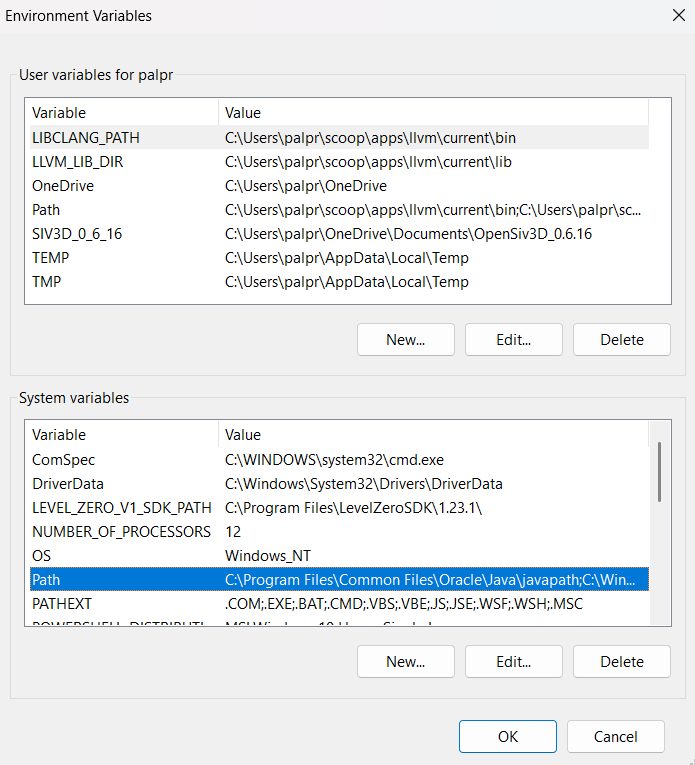

# Campus Course & Records Manager (CCRM)

CCRM is a console-based Java application for managing students, courses, enrollments, and grades for an educational institute.

## How to Run

1.  **Prerequisites**:
    * Java Development Kit (JDK) 21 or later.
    * An IDE like Eclipse or IntelliJ, or just a command line.

2.  **Compile and Run (from root `CCRM_Project` directory)**:
    * **Compile**: `javac -d out --source-path src src/edu/ccrm/Main.java`
    * **Run**: `java -cp out edu.ccrm.Main`
    * **Enable Assertions**: `java -ea -cp out edu.ccrm.Main`

---

## Evolution of Java

* **1995**: Java 1.0 released by Sun Microsystems.
* **1998**: J2SE 1.2 (Java 2) released, introducing Swing, Collections framework.
* **2004**: J2SE 5.0 (Tiger) released with major features like Generics, Annotations, Autoboxing, and Enums.
* **2014**: Java SE 8 released, a landmark version with Lambdas, Streams API, and a new Date/Time API.
* **2017**: Java SE 9 introduced the Module System (Project Jigsaw).
* **2018-Present**: Shift to a 6-month release cycle. Recent LTS (Long-Term Support) versions include Java 11, 17, and 21, bringing features like `var`, Records, Pattern Matching, and Virtual Threads.

---

## Java ME vs. SE vs. EE

| Feature          | Java ME (Micro Edition)                | Java SE (Standard Edition)              | Java EE (Enterprise Edition)                  |
| ---------------- | -------------------------------------- | --------------------------------------- | --------------------------------------------- |
| **Primary Use** | Resource-constrained embedded devices  | Desktop, servers, general-purpose apps  | Large-scale, distributed enterprise systems   |
| **Core API** | A small subset of the Java SE API      | The core Java programming platform      | Extends Java SE with enterprise APIs          |
| **Key APIs** | `CLDC`, `MIDP` for mobile profiles     | `java.lang`, `java.util`, Swing, JDBC    | Servlets, JSP, EJB, JPA, RESTful web services |
| **Typical App** | Old mobile games, IoT sensors          | This CCRM project, desktop calculators  | Banking systems, e-commerce platforms         |

---

## Java Architecture: JDK, JRE, JVM

* **JVM (Java Virtual Machine)**: An abstract machine that provides a runtime environment to execute Java bytecode. It's platform-dependent and interprets the compiled `.class` files.
* **JRE (Java Runtime Environment)**: A software package that contains what's needed to run Java programs (but not develop them). It includes the JVM and core Java libraries.
* **JDK (Java Development Kit)**: A superset of the JRE. It contains everything in the JRE, plus development tools like the compiler (`javac`) and debugger (`jdb`). You need the JDK to write and compile Java code.

**Interaction**: You write `.java` code -> The **JDK**'s compiler (`javac`) creates `.class` bytecode -> The **JRE**'s **JVM** executes that bytecode.


---

## Setup on Windows (with Screenshots)

1.  **Download JDK**: Go to the [Oracle Java Downloads](https://www.oracle.com/java/technologies/downloads/) page and download the JDK Installer for Windows.
2.  **Run Installer**: Execute the downloaded `.exe` file and follow the on-screen instructions.
3.  **Set Environment Variables**:
    * Open "Edit the system environment variables".
    * Set `JAVA_HOME` to your JDK installation path (e.g., `C:\Program Files\Java\jdk-21`).
    * Edit the `Path` variable and add `%JAVA_HOME%\bin`.
    * **
4.  **Verify**: Open Command Prompt and run `java --version` and `javac --version`.
    * *(Your screenshot of the command prompt verification would go here)*

## Setup in Eclipse IDE

1.  **Create Project**: `File > New > Java Project`. Enter a project name.
2.  **Create Packages**: Right-click the `src` folder `> New > Package`. Create the required packages (`edu.ccrm.cli`, etc.).
3.  **Create Classes**: Right-click a package `> New > Class`.
4.  **Run Application**: Right-click the `Main.java` file `> Run As > Java Application`.
    * **

---

## Errors vs Exceptions in Java

**Errors** are serious problems that applications typically shouldn't try to catch or handle:
- `OutOfMemoryError`: JVM runs out of memory
- `StackOverflowError`: Stack memory is exhausted (often due to infinite recursion)
- `NoClassDefFoundError`: A class was available at compile time but not at runtime

**Exceptions** are conditions that applications might want to catch and handle:
- **Checked Exceptions**: Must be declared in method signatures or caught
  - `IOException`: File/network operations
  - Custom exceptions in our project: `StudentNotFoundException`, `DuplicateEnrollmentException`
- **Unchecked Exceptions** (Runtime Exceptions): Don't need to be declared
  - `IllegalArgumentException`: Invalid method arguments
  - `NullPointerException`: Attempting to use null references

Our CCRM project demonstrates both checked exceptions (custom business logic exceptions) and unchecked exceptions (validation errors).

## Running with Assertions

Assertions are used to verify invariants and catch programming errors during development. They are **disabled by default** in Java.

**Enable assertions when running:**
```bash
java -ea -cp out edu.ccrm.Main
```

**What assertions check in our project:**
- Course codes follow proper format (e.g., "CS101", "MATH201")
- Credit values are within valid ranges (1-9)
- Student registration numbers follow pattern (R + 7 digits)
- Business rules (e.g., students can't enroll in more than 10 courses)

**Important:** Assertions should only check for programming errors, not user input validation. They can be disabled in production, so never rely on them for security or business logic.

If an assertion fails, it indicates a bug in the code that should be fixed during development.

---

## Syllabus Topic to Code Mapping

| Topic                            | File/Class/Method Where Demonstrated                            |
| -------------------------------- | --------------------------------------------------------------- |
| **Packages & `main` class** | `edu.ccrm.*` packages, `Main.java`                              |
| **OOP Pillars** | `Person` (Abstract), `Student` (Inherit), `Course` (Encap), `Transcript` (Poly) |
| **Data Types & Operators** | `OperatorDemo.java` (all operators & precedence), `Transcript::calculateGPA` (arithmetic) |
| **Control Flow (if, switch, loops)** | `CCRM_CLI.java` (main `while` loop, `switch` menu, `do-while`, labeled `break`) |
| **Arrays & `Arrays` Class** | `ArrayDemo.java` (sorting, searching, copying, comparing) |
| **Strings** | `ImportExportService` (`split`, `join`), `Validator` (`matches`) |
| **Interfaces & `default` methods** | `Searchable.java` & `Filterable.java` (default methods, diamond problem resolution) |
| **Abstract & Nested Classes** | `Person` (abstract), `Course.Builder` (static nested), `CCRM_CLI` (anonymous inner class) |
| **Enums with fields/constructors** | `Grade.java`, `Semester.java`                                   |
| **Lambdas & Functional Interfaces**| `CourseService::searchCourses` (Predicate), `ReportingService` (Comparator) |
| **Casting & instanceof** | `CastingDemo.java` (upcast, downcast, pattern matching) |
| **Exception Handling (Custom)** | `EnrollmentService` (`try-catch`, `throws`), `exception` package |
| **Assertions** | `Course.Builder.build()`, `Student` constructor (invariant checking) |
| **NIO.2 (Path, Files, Streams)** | `ImportExportService.java`, `BackupService.java`                |
| **Date/Time API** | `Student.java` (`LocalDate`), `BackupService.java` (`LocalDateTime`) |
| **Recursion** | `RecursiveFileUtils::calculateDirectorySize`                    |
| **Design Patterns** | `AppConfig` (Singleton), `Course.Builder` (Builder)             |